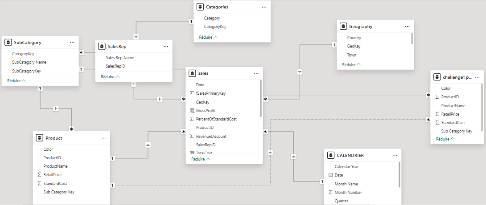

## **what did we do in power bi**  
This project demonstrates a comprehensive business intelligence solution using Power BI to analyze sales data and create interactive dashboards for data-driven decision making.
### **Summary**
- Imported sales data  
- Did some data cleaning with power query  
- Created some calculated columns and new measures  
- Created a report with some visualisations  
- Imported additionnal data from mysql 
- managed access to reports 
- published the report and created a dashboard  

### **Explanation**  
# Power BI Sales Analytics Project

## 📊 Project Overview

### 📥 Data Import & Integration
- **Imported sales data** from multiple sources to create a unified dataset
- **Connected to MySQL database** to pull additional business data and ensure real-time data synchronization

### 🧹 Data Transformation & Cleaning
- **Performed data cleaning using Power Query** to ensure data quality and consistency
  - Removed duplicates and null values
  - Standardized data formats and naming conventions
  - Applied data type corrections

### 📈 Data Modeling & Calculations
- **Created calculated columns** to derive new insights from existing data
- **Developed custom measures** using DAX (Data Analysis Expressions) for advanced analytics
  - Sales performance metrics
  - Growth rates and trend analysis
  - Key Performance Indicators (KPIs)

### 📊 Visualization & Reporting
- **Built comprehensive reports** with interactive visualizations including:
  - Sales trends over time
  - Regional performance analysis
  - Product category breakdowns
  - Customer segmentation insights

### 🔐 Access Management & Security
- **Configured user access controls** to ensure appropriate data visibility
- **Set up row-level security** where necessary to protect sensitive information
- **Managed report permissions** for different stakeholder groups

### 🚀 Deployment & Dashboard Creation
- **Published reports to Power BI Service** for organization-wide access
- **Created interactive dashboards** that provide real-time insights
- **Enabled automatic data refresh** to keep information current

## 📋 Data Model
Our data model establishes relationships between various data sources to enable comprehensive analysis across all business dimensions.

## 🎯 Business Impact
This Power BI solution enables stakeholders to:
- Make data-driven decisions with real-time insights
- Identify sales trends and opportunities
- Monitor KPIs and performance metrics
- Access self-service analytics capabilities
